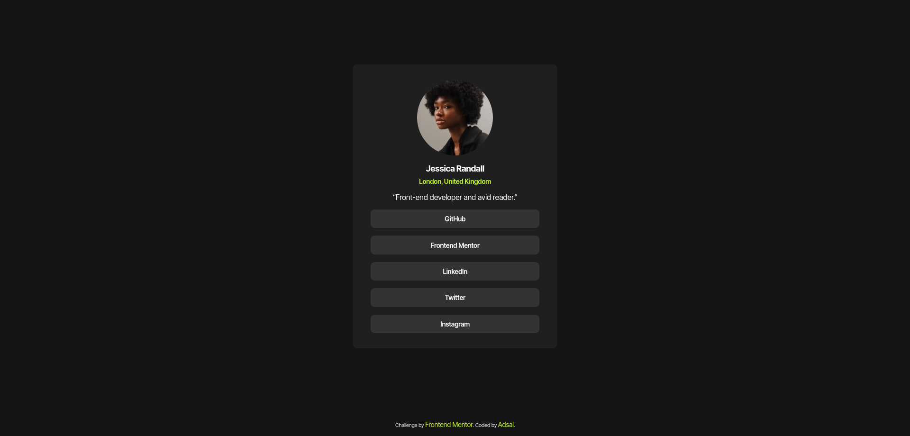

# Frontend Mentor - Social links profile solution

This is a solution to the [Social links profile challenge on Frontend Mentor](https://www.frontendmentor.io/challenges/social-links-profile-UG32l9m6dQ). Frontend Mentor challenges help you improve your coding skills by building realistic projects. 

## Table of contents

- [Overview](#overview)
  - [The challenge](#the-challenge)
  - [Screenshot](#screenshot)
  - [Links](#links)
- [My process](#my-process)
  - [Built with](#built-with)
  - [What I learned](#what-i-learned)
  - [Continued development](#continued-development)
  - [Useful resources](#useful-resources)
  - [AI Collaboration](#ai-collaboration)
- [Author](#author)

## Overview

### The challenge

Users should be able to:

- See hover and focus states for all interactive elements on the page.

### Screenshot



### Links

- Solution URL: [github repo](https://github.com/a-adsal/social-links-profile-main)
- Live Site URL: [project live page on github](https://a-adsal.github.io/social-links-profile-main/)

## My process

### Built with

- Semantic HTML5 markup
- CSS custom properties
- Flexbox
- CSS Grid

### What I learned

- Looking back, I’ve learned that taking a systematic approach to web development is undeniably challenging and time consuming but so rewarding. There’s real joy in seeing everything come together nicely, to me this is the most valuable lesson from this challenge, even from such a small project.

Footnote: The <a> tag is an inline element, and it took me a while to remember that, which means you can't directly apply width to it, until you change it to a block element using the css display property :).

#### I am proud of this html structure :) (thanks to Keven Geary, and page building 101 youtube playlist)
```html
 <figure class="social-link__figure">
            
            <figcaption>
              <div class="title__wrapper">
                <h1 class="title">Jessica Randall</h1>
                <p class="lead">London, United Kingdom</p>
              </div>
              <q>Front-end developer and avid reader.</q>
            </figcaption>
          </figure>
```

### Continued development

- Building the HTML structure for this project was a bit confusing and took me extra time to figure out.
- I was slow to identify the best approach for the design system, and there is still more room for improvement.
- I’m not satisfied with my CSS or with my basic CSS system, but I’ll leave refining them for the next FrontendMentor challenge.

### Useful resources

- [page building 101 - by Keven Geary](https://www.youtube.com/watch?v=low3gKk1jrs&list=PLBpy-YllkBayfAi3Hc7VfAI2pqQN6Aj3Q) - HTML structure and Semantics, CSS selectors and nesting.
- [Kevin Powell](https://www.youtube.com/@KevinPowell) - the best CSS tips on the internet.


### AI Collaboration

For my educational purposes, I did not rely on AI.

## Author

- github - [Adsal](https://github.com/a-adsal)
- Frontend Mentor - [@a-adsal](https://www.frontendmentor.io/profile/a-adsal)
- I don't use social media at all.

